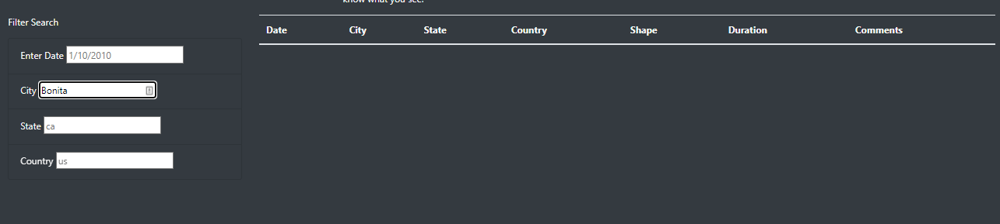

# **UFOs**

## **Overview**
This project is creating an interactive experience for a set of data representing UFO sightings across multiple countries in 2010. The project advocates for transparency around the topic by publishing the data in a public setting and allowing visitors to the site to view and consider the evidence independently.

The site lives at https://vincentpw21.github.io/ufos/

## **Results**
The site has filters that allow you to narrow the the results of the table seen on screen (highlighted in red).

These filters are powerful if you know how to best work with them. As seen in the example below you can filter by a few fields. In this instance we are narrowing down to a specific day. 

Yet the site allows for more than 1 filter to be leveraged at one time. Building on the previous example you can now focus the table to only sightings in a specific state like New Jersey.

The one watch out is that you must search the table fields using the existing case sensitivity. For example, if we were to search for sightings in the city of Bonita, CA and capitalize the name of the city we would get no results.

Yet when we match the case of the column (lowercase only for city, state and country fields) we'll see the appropriate results.

## **Summary**
The site is a solid resource to display and allow the searching of this data set. 

### **Issue** 
Yet there is room for more optimizations. First allowing for case sensitivity to be less of a limiting factor for the searcher would improve the user experience. Requiring intimate knowledge of how the data is formatted should not be a necessary step to leveraging the data set.

### **Reccomendations**
1. Allowing for the sorting of the table based on column headers would allow for easier segmenting of data without applying filters.
2. The dataset is rather limited in scale without clarity about what time span it covers and when it was last updated. Beyond this critical context the dataset could be pointing to a live data source (pulled via an API) rather than a static JSON document holding a limited set of UFO sightings.